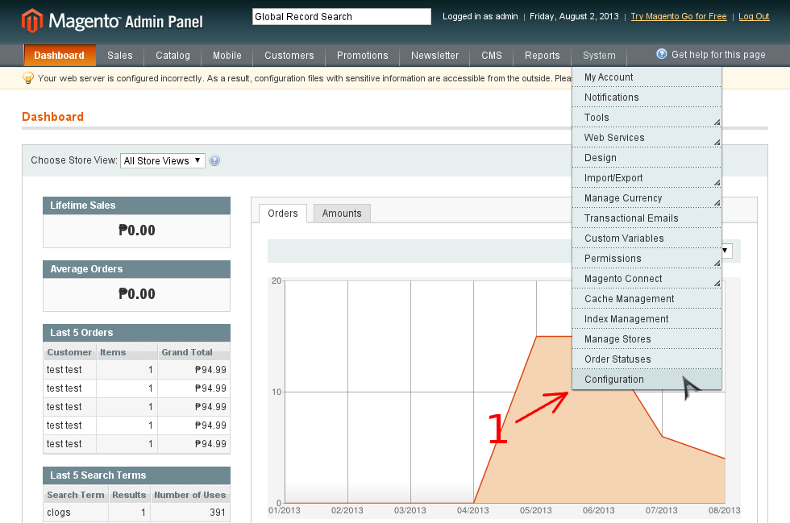
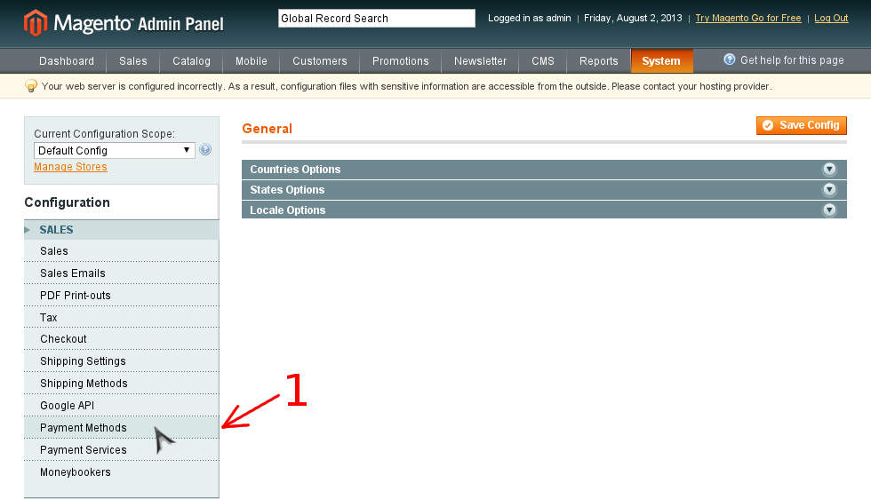
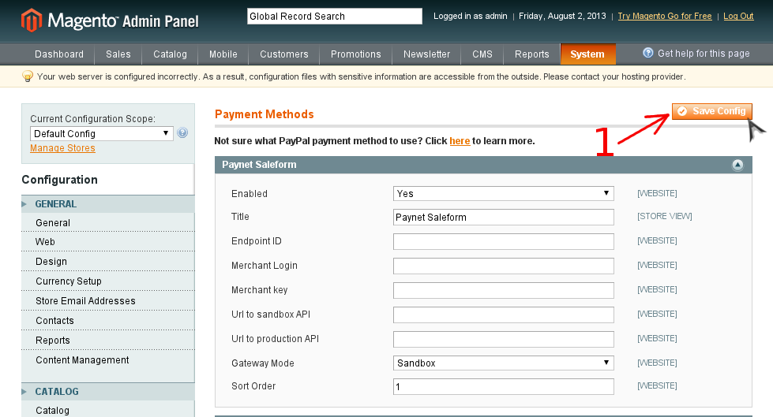

# Plugin for Magento 1.x for pay by PaynetEasy

## Available functions

This plugin allows merchant to make payments via [merchant PaynetEasy API](http://wiki.payneteasy.com/index.php/PnE:Merchant_API). These payment methods are available at the moment:
- [x] [Sale Transactions](http://wiki.payneteasy.com/index.php/PnE:Sale_Transactions)
- [ ] [Preauth/Capture Transactions](http://wiki.payneteasy.com/index.php/PnE:Preauth/Capture_Transactions)
- [ ] [Transfer Transactions](http://wiki.payneteasy.com/index.php/PnE:Transfer_Transactions)
- [ ] [Return Transactions](http://wiki.payneteasy.com/index.php/PnE:Return_Transactions)
- [ ] [Recurrent Transactions](http://wiki.payneteasy.com/index.php/PnE:Recurrent_Transactions)
- [x] [Payment Form Integration](http://wiki.payneteasy.com/index.php/PnE:Payment_Form_integration)
- [ ] [Buy Now Button integration](http://wiki.payneteasy.com/index.php/PnE:Buy_Now_Button_integration)
- [ ] [eCheck integration](http://wiki.payneteasy.com/index.php/PnE:eCheck_integration)
- [ ] [Western Union Integration](http://wiki.payneteasy.com/index.php/PnE:Western_Union_Integration)
- [ ] [Bitcoin Integration](http://wiki.payneteasy.com/index.php/PnE:Bitcoin_integration)
- [ ] [Loan Integration](http://wiki.payneteasy.com/index.php/PnE:Loan_integration)
- [ ] [Qiwi Integration](http://wiki.payneteasy.com/index.php/PnE:Qiwi_integration)
- [ ] [Merchant Callbacks](http://wiki.payneteasy.com/index.php/PnE:Merchant_Callbacks)

## System requirements

* PHP 5.3 - 5.5
* [Curl extension](http://php.net/manual/en/book.curl.php)
* [Magento](http://www.magentocommerce.com/download) 1.x (plugin was tested with 1.7)

##  Getting plugin package

### Package assembling
1. [Install composer](http://getcomposer.org/doc/00-intro.md), if it is not installed already
2. Clone plugin’s repository: `composer create-project payneteasy/php-plugin-magento --stability=dev --prefer-dist`
3. Go to plugin’s folder: `cd php-plugin-magento`
4. Pack plugin to archive: `composer archive --format=zip`

## Installing plugin

1. [Get plugin package](#get_package)
2. Extract package to Magento’s root folder

## Configuring plugin

1. Go to Magento’s admin panel
2. Go to System -> Configuration (See picture)

    
3. Go to Payment Methods in Configuration column (See picture)

    
4. Configure plugin
    1. Fill in the form with plugin settings
    2. Save plugin settings (See picture)

    

## Uninstalling plugin

In order to uninstall this plugin, the folders and files listed below should be deleted. Paths are relevant to Magento’s root folder:

* `app/code/local/PaynetEasy/`
* `app/design/frontend/base/default/template/paynet/`
* `app/etc/modules/PaynetEasy_Paynet.xml`
* `lib/composer/`
* `lib/payneteasy/`
* `lib/autoload.php`